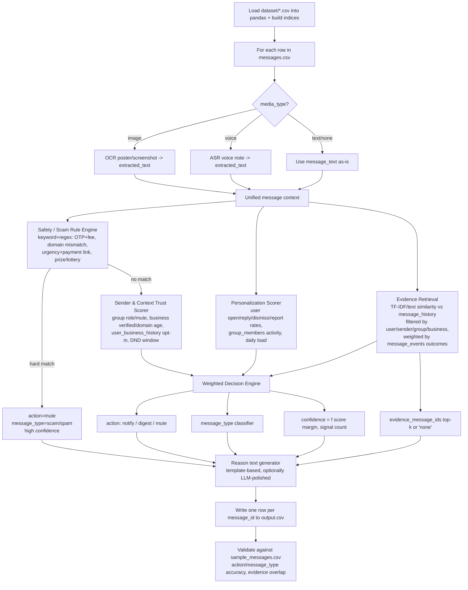

# Message Notification Router — Implementation Plan

## Where things stand

- `code/main.py` and `code/evaluation/main.py` are empty stubs — nothing is implemented yet.
- `dataset/messages.csv` has **110** actual messages to route (63 group, 30 business, 17 personal; 87 text / 15 image / 8 voice) — the "265 lines" you'd get from a naive line count is misleading because some `message_text` fields contain embedded newlines.
- `dataset/sample_messages.csv` has **70 labeled examples** — the only ground truth available, and it's rich: action/message_type distributions, and worked examples for image and voice messages with reasons like *"user opted out of similar marketing,"* *"verified business, not urgent,"* *"close contact sent urgent voice request."*
- `dataset/message_history.csv` (1062 rows) + `dataset/message_events.csv` (open/reply/dismiss/report outcomes) is the evidence/retrieval corpus.
- Context tables: `users.csv` (DND window + engagement), `groups.csv`/`group_members.csv` (role, mute state, activity), `business_accounts.csv` (verified, domain, reports), `user_business_history.csv` (opt-in/out, orders), `daily_notification_summary.csv` (notification load).
- Media: 20 images, 13 audio files under `dataset/media/` — only some referenced by `messages.csv`. Python 3.14 and Node 24 are both installed locally, so either is a viable language choice.

## Recommended approach

Build a **deterministic, rule/scoring-based pipeline first**, with an *optional* LLM layer bolted on only for reason-text polish and media understanding (behind an env var, with a working non-LLM fallback). Reasoning:

- The contract explicitly wants "deterministic where possible" and forbids hardcoded labels — a scorecard you can inspect and tune against `sample_messages.csv` is safer and faster to iterate on in 24h than prompting an LLM 110 times and hoping it's consistent.
- Safety-first: per the spec, obvious scam/phishing must mute **regardless of engagement history** — this needs a hard rule override sitting above any learned/weighted score, not something an LLM might soften.
- Media (OCR/ASR) is a hard requirement ("inspect the media files themselves") but the grading machine's environment is unknown, so the media layer must degrade gracefully if optional libraries/binaries aren't present — never crash the whole run.

## Flow diagram



## Module layout (Python, `code/`)

```
code/
├── main.py                    # CLI entry: python code/main.py -> writes dataset/output.csv
├── router/
│   ├── data_loader.py         # load all CSVs, build lookup indices (by user/group/business/sender)
│   ├── media.py                # OCR (pytesseract) + ASR (faster-whisper) with try/except fallback
│   ├── safety_rules.py         # scam/phishing/urgency keyword+regex hard rules
│   ├── trust_scorer.py         # sender/group/business trust signals
│   ├── personalization.py      # per-user engagement + DND + daily load signals
│   ├── retrieval.py            # TF-IDF similarity + message_events-weighted evidence selection
│   ├── decision.py             # combines scores -> action/message_type/confidence
│   ├── reason.py               # human-readable reason templates (+ optional LLM polish)
│   └── writer.py                # output.csv writer, schema/order enforcement
└── evaluation/
    └── main.py                  # scores pipeline output against sample_messages.csv labels
```

## Key design decisions worth calling out

1. **Hard override for safety**: any scam/phishing signal (mismatched sender domain vs. business's official domain, OTP+fee combos, urgency+payment-link patterns) short-circuits straight to `mute` + `scam`/`spam`, bypassing the trust/personalization scorers entirely — matches the spec's explicit safety-first requirement.
2. **Group-mute + mention exception**: if `group_members.group_muted_by_user=1` but the message directly @mentions the user or is clearly safety/urgent, don't blindly mute — matches "a muted family group can still contain an urgent direct mention."
3. **Evidence retrieval scoped, not global**: search `message_history` restricted to the same `user_id` first (and same sender/group/business as fallback), not the whole 1062-row corpus, so `evidence_message_ids` stay relevant rather than coincidentally similar text from a stranger's history.
4. **Confidence calibration**: derive numerically from how many independent signals agree (safety, trust, personalization, retrieval) and the score margin from the decision threshold — not a flat 0.8 for everything, since "reasonable confidence calibration" is graded.
5. **Media fallback**: wrap `pytesseract`/`faster-whisper` imports in try/except; if unavailable at runtime, fall back to filename/metadata-only heuristics with visibly lower confidence rather than crashing — keeps "runnable from the terminal" true on any grading machine.
6. **No hardcoded labels**: `sample_messages.csv` is used only for offline validation in `code/evaluation/main.py`, never merged into the routing logic itself.

## Implementation Phases

Each phase has a clear exit criterion and a test method, so you never move to the next phase on an untested foundation. Run the phase's test *before* starting the next phase — cascading bugs from an unverified phase 2 are the most expensive kind to debug at phase 7.

---

### Phase 0 — Environment & Scaffolding
**Time:** 0:00–0:45

**Tasks**
- Create `code/router/` package with empty module files per the layout above.
- Write `requirements.txt` (pandas, scikit-learn to start; pytesseract/faster-whisper added in Phase 4).
- Write `code/main.py` as a CLI stub that just loads CSVs and prints row counts.
- Add `.env.example` documenting any optional API key vars (none required to run).

**Exit criteria:** `python code/main.py` runs with no errors and prints the row counts you already confirmed (110 messages, 70 samples, 1062 history rows, etc.).

**Test method:** Manual run + eyeball counts against the numbers already verified in exploration. No automated test needed yet — this phase just proves the environment works end to end.

---

### Phase 1 — Data Loading & Indexing
**Time:** 0:45–1:30

**Tasks**
- `data_loader.py`: load all 12 CSVs into pandas DataFrames with explicit dtypes (esp. IDs as strings, not inferred ints/floats).
- Build lookup indices: `by_user_id`, `by_group_id`, `by_business_id`, `by_sender_user_id`, and a `message_history` index scoped by `user_id`.
- Handle missing/blank fields (empty `group_id`, `business_id`, `sender_user_id`) without NaN leaking into string comparisons.

**Exit criteria:** For any `message_id` in `messages.csv`, you can pull the full joined context (user record, group record if applicable, business record if applicable, sender's history) in one function call.

**Test method:** Write a small `tests/test_data_loader.py` (pytest) that:
- Asserts row counts match known values (110 messages, 55 users, etc.).
- Picks 3–4 known message_ids from `sample_messages.csv` (one group, one business, one personal) and asserts the joined context returns the expected group_name / business display_name / user DND window.
- Asserts no exceptions on rows with blank `group_id`/`business_id`/`sender_user_id`.

---

### Phase 2 — Safety / Scam Rule Engine
**Time:** 1:30–3:00

**Tasks**
- `safety_rules.py`: regex/keyword detectors — OTP+fee combos, domain mismatch (`business_accounts.official_domain` vs `domain_used_by_sender`), urgency+payment-link patterns, prize/lottery language.
- Returns a hard `(is_unsafe, message_type, confidence, reason)` tuple or `None` if no match.

**Exit criteria:** Runs standalone on message text without needing the full pipeline.

**Test method:** This is the most testable phase since `sample_messages.csv` has 4 `scam` and 1 `spam` labeled rows — use them as your first regression test:
- Extract those rows, run `safety_rules.py` against each `message_text`, assert it fires and matches the labeled `message_type`.
- Extract a handful of clearly legitimate rows (e.g., `notify`/`urgent` family messages) and assert the rule engine does **not** false-positive on them — false positives here are worse than false negatives since this phase is a hard override.
- Track precision/recall manually in a short table as you tune keyword lists.

---

### Phase 3 — Trust & Personalization Scoring
**Time:** 3:00–4:15

**Tasks**
- `trust_scorer.py`: group role/mute state, business verified/account age/report count, `user_business_history` opt-in/opt-out and relationship recency.
- `personalization.py`: per-user open/reply/dismiss/report rates from `users.csv` + `group_members.csv`, DND window check against `created_at`, `daily_notification_summary` load check.
- Each scorer returns a numeric signal (e.g., -1 to +1) plus the human-readable factor that drove it (for later reason-text generation).

**Exit criteria:** Given any message context from Phase 1, both scorers return a score + explanation without crashing on missing history (e.g., a business with no `user_business_history` row).

**Test method:**
- Unit tests with hand-built fixture rows: a message from an admin in a non-muted group (expect positive trust score) vs. a message from a muted group with no mention (expect negative/neutral) vs. a verified long-standing business with an active order relationship (expect positive) vs. an unverified new-domain business (expect negative).
- Cross-check against 8–10 `sample_messages.csv` rows spanning `notify`/`digest`/`mute` and confirm the *sign* of the combined trust+personalization score is directionally consistent with the labeled action (you're not expecting exact match yet — that's Phase 6).

---

### Phase 4 — Media Pipeline (OCR + ASR)
**Time:** 4:15–6:00

**Tasks**
- `media.py`: `extract_image_text(path)` via pytesseract, `extract_voice_text(path)` via faster-whisper (or whisper), each wrapped in try/except with a clear fallback (empty string + low-confidence flag) if the library/binary isn't available.
- Wire extracted text back into the same context object Phase 2/3 consume, so image/voice messages flow through the identical rule and scoring logic as text messages.

**Exit criteria:** Running the pipeline on all 15 image and 8 voice messages in `messages.csv` produces non-empty extracted text for the clear majority, and never throws.

**Test method:**
- Manually inspect 3–4 `dataset/media/images/*.jpg` and `dataset/media/audio/*.mp3` files referenced by `sample_messages.csv`'s image/voice rows, compare OCR/ASR output against what you'd expect a human to read/hear, and sanity-check it's in the right ballpark (doesn't need to be perfect transcription).
- Temporarily rename/hide the OCR/ASR dependency (or force the except branch) and confirm the pipeline still runs to completion with degraded-but-present output — this is the test that actually matters for grading-machine robustness.

---

### Phase 5 — Evidence Retrieval
**Time:** 6:00–7:00

**Tasks**
- `retrieval.py`: TF-IDF vectorize `message_history` scoped to the same `user_id` (fallback to same `sender_user_id`/`group_id`/`business_id` if the user-scoped pool is empty), rank by cosine similarity, weight by `message_events` outcome (opened/replied boosts relevance; dismissed/reported lowers it).
- Returns top-k `message_id`s above a similarity threshold, or `none`.

**Exit criteria:** For any message, retrieval returns either a ranked evidence list or `none` — never crashes on an empty history pool.

**Test method:**
- Run retrieval on the `sample_messages.csv` rows that already have `evidence_message_ids` filled in and check overlap: does your retrieved set intersect with the labeled evidence, or point at similarly-themed history? Exact match isn't required (evidence selection is graded on relevance, not exact ID match) but near-miss cases tell you if the similarity threshold or scoping is off.
- Spot-check 2–3 rows where the label is `none` and confirm your retrieval also returns nothing above threshold (checks the threshold isn't too loose).

---

### Phase 6 — Decision Engine
**Time:** 7:00–8:15

**Tasks**
- `decision.py`: combine Phase 2 (hard override), Phase 3 (trust + personalization scores), and Phase 5 (evidence weight) into a single weighted score → `action` via thresholds.
- `message_type` classifier layered on top (keyword/category rules + conversation_type + business category).
- Confidence = function of score margin from threshold + number of agreeing signals.

**Exit criteria:** Produces a complete `(action, message_type, confidence)` triple for every message context.

**Test method:** This is the integration test — run the full pipeline against all 70 `sample_messages.csv` rows (ignoring their labels as input, using them only to score afterward) and compute:
- Action accuracy (exact match against labeled `action`).
- Message_type accuracy.
- Confusion matrix for action (notify/digest/mute) to see which direction you're erring — e.g., over-muting notify-worthy messages is worse than the reverse.
- Iterate thresholds/weights until action accuracy is comfortably above a baseline majority-class guess (majority class here is `digest` at ~31/70, so target well above 44%).

---

### Phase 7 — Reason Generation & Output Writer
**Time:** 8:15–9:00

**Tasks**
- `reason.py`: template-based human-readable reason strings built from the specific factors that fired (e.g., "Verified business with an active order relationship; not time-sensitive." rather than a generic "Business message").
- `writer.py`: emit `output.csv` with exact column order, one row per `message_id`, in the same order as `messages.csv`.

**Exit criteria:** `output.csv` is schema-valid and covers all 110 message_ids.

**Test method:**
- Automated check: row count matches `messages.csv` row count exactly, columns match required schema exactly, no blank `action`/`message_type`/`confidence` cells, `confidence` values are within `[0,1]`, `evidence_message_ids` is either `none` or semicolon-separated valid `message_id`s that exist in `message_history.csv`.
- Manual read-through of ~15 random reason strings to confirm they read naturally and aren't repeating the same 3 templates verbatim for dissimilar messages.

---

### Phase 8 — End-to-End Evaluation Harness
**Time:** 9:00–9:45

**Tasks**
- `code/evaluation/main.py`: runs the full pipeline against `sample_messages.csv`, reports action accuracy, message_type accuracy, evidence relevance overlap, and confidence calibration (e.g., are `notify` predictions clustered at higher confidence than `digest`?).
- Save a small report (console output or `eval_report.txt`) so you can track score improvements as you tune.

**Exit criteria:** One command (`python code/evaluation/main.py`) reproduces your validation metrics from Phase 6, so future tuning is measurable rather than vibes-based.

**Test method:** Re-run after every tuning change in Phase 9 and diff the metrics — this phase *is* the test harness for everything downstream.

---

### Phase 9 — Polish, Edge Cases & Packaging
**Time:** 9:45–11:00 (+ buffer)

**Tasks**
- Sweep edge cases: rows with all-blank optional context (new sender with no history), forwarded messages with high `forwarded_count`, messages exactly at DND window boundaries.
- Tune thresholds/keyword lists using Phase 8's metrics.
- Write the submission README (setup, run command, design notes) and assemble `code.zip`.
- Optional stretch (only if ahead of schedule): LLM-assisted reason polish or media captioning behind `ANTHROPIC_API_KEY`, swap TF-IDF for sentence-embedding retrieval.

**Exit criteria:** Full pipeline runs clean from a fresh checkout, `output.csv` validated, README instructions verified by literally following them yourself.

**Test method:** Simulate the grader — clone/copy the repo to a clean folder (or clean venv), follow only the README instructions, run the command, confirm `output.csv` is produced with no manual intervention.
